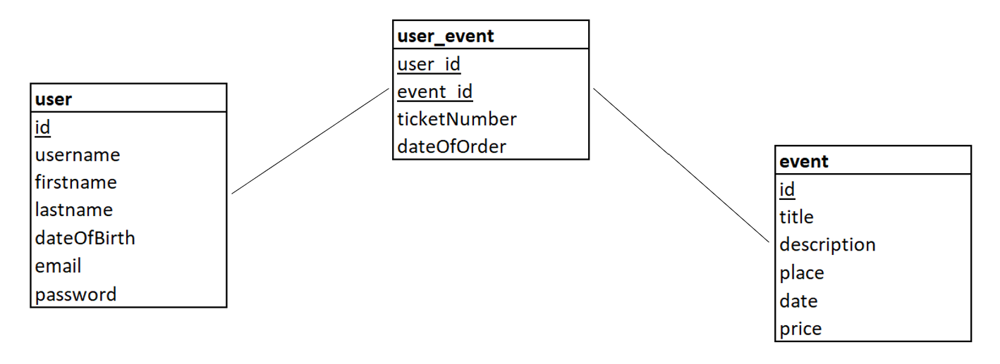

# Projet Architecture Logicielle

## Auteurs

- Kevin Doolaeghe
- Romain Haye
- Quentin Maesen

## Installation

```
chmod +x install.sh
./install.sh
```

## Organisation Evénementiel

### __Workflows :__
- Création de compte
- Gestion des évènements
- Participation aux évènements

### __Fonctionnalités :__
- Création de compte
  - Créer un compte
  - Modifier un compte
  - Supprimer un compte
  - Afficher le compte
- Gestion des évènements
  - Ajouter un évènement
  - Modifier un évènement
  - Supprimer un évènement
  - Lister les évènements
  - Reporter un évènement
- Participation aux évènements
  - Ajouter au panier
  - Passer la commande

### __Domaines :__
- Evènement
- Utilisateur
- Participant

### __Entités :__
- Evènement
  - Nom
  - Description
  - Image
  - Lieu
  - Date
  - Durée
  - Nombre de participants maximum
  - Prix
- Utilisateur
  - Nom
  - Prénom
  - Date de naissance
  - Adresse mail
  - Numéro de téléphone
- Participant
  - Numéro billet
  - Date de commande
  - Identifant évènement

### __Modèle relationnel de données :__

\
